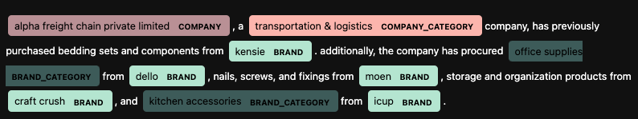

# concept-scouter

ner -> LLM -> ner

```
python ner_cli.py --help
Usage: ner_cli.py [OPTIONS] COMMAND [ARGS]...

Options:
  --install-completion [bash|zsh|fish|powershell|pwsh]
                                  Install completion for the specified shell.
  --show-completion [bash|zsh|fish|powershell|pwsh]
                                  Show completion for the specified shell, to
                                  copy it or customize the installation.
  --help                          Show this message and exit.

Commands:
  format-kaggle  Formats `company` and `brand` data from kaggle
  gen-llm-text   Generates both prompts + retrieves LLM responses for...
  llm2spacy      Converts the synthetic, llm-generated text into spacy...
  train_model    Will train an NER model, assumes that training data has...
```

When a model is trained, the following can be run

```python
import spacy

nlp_ner = spacy.load("spacy-output/model-last")
text = """
alpha freight chain private limited, a transportation & logistics company,
has previously purchased bedding sets and components from kensie.
additionally, the company has procured office supplies from dello, nails,
screws, and fixings from moen, storage and organization products from
craft crush, and kitchen accessories from icup.
"""

doc = nlp_ner(text)
colors = {"COMPANY": "#B99095", "COMPANY_CATEGORY": "#FCB5AC", "BRAND":"#B5E5CF", "BRAND_CATEGORY": "#3D5B59"}
options = {"colors": colors} 
print(doc.ents)


spacy.displacy.render(doc, style="ent", options=options, jupyter=True)
```

The notebook UI visual will look like the following:




## Dataset

```
https://www.kaggle.com/datasets/charanpuvvala/company-classification
https://www.kaggle.com/datasets/carrie1/ecommerce-data
https://www.kaggle.com/datasets/hma2022/amazon-global-store-us-from-saudi-souq
```


## installing spacy

```sh
pip install -U pip setuptools wheel
pip install -U 'spacy[apple]'
python -m spacy download en_core_web_sm
```

## How to get a `base_config.cfg` for spacy

https://spacy.io/usage/training

What to do with the base config

```sh
python -m spacy init fill-config scouter/base_config.cfg config.cfg
python -m spacy init fill-config scouter/tfmr_config.cfg config.cfg
```


## How to train

```sh
# general template
python -m spacy train config.cfg --output ./ --paths.train ./training_data.spacy --paths.dev ./training_data.spacy --gpu-id 0
```

but for our purposes:

```sh
python -m spacy train config.cfg --output ./spacy-output/ --paths.train /tmp/train.spacy --paths.dev /tmp/train.spacy

python -m spacy train config.cfg --output ./spacy-output/ --paths.train /tmp/train.spacy --paths.dev /tmp/train.spacy --gpu-id 0
```